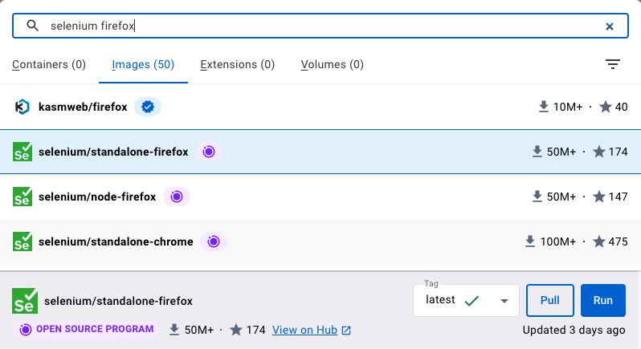

Interested in antibiotic prescribing practices at the provider level

Medicare Part D (prescription drug benefit), went into effect in 2006. As of 2022, 49 million Americans enrolled in Part D. So lots of data on prescriptions.

A number of pubically-available Part D datasets. The one I'll be talking about is the by provider dataset, which details prescribing practices for a calendar year by provider. Example data looks like this (see table I created below).

What I'm interested in doing with this is getting an estimate of the rate of antibiotic prescribing for different providers. We can compute this by getting the number of antibiotic claims (prescriptions) out of the total number of beneficiaries. We can model this quantity while making adjustments based on features of the provider--their type, gender, practice location, rurality of practice--and patient features--on average how old they are, how healthy they are, how many are female/male.

I want to write a script to automatically get these data for every year they're available. This page shows the years that are available, and gives the IDs for the data from each year. The IDs are needed to get data for each year.

https://data.cms.gov/provider-summary-by-type-of-service/medicare-part-d-prescribers/medicare-part-d-prescribers-by-provider/api-docs

So what would be nice is if I could just read this table, then loop over the IDs to get all of the different years. This is typically easy to do--write a program to automatically scrape the table.

Problem! When I look at the HTML source for the page, there's no table.


```r
<!doctype html>
<html lang="en">
<head>
    <base href="">
    <title>Centers for Medicare & Medicaid Services Data</title>
    <script type="text/javascript" defer="defer">
    window.utag_cfg_ovrd = {
        noview: !0
    }
    </script>
    <script type="text/javascript" src="//tags.tiqcdn.com/utag/cmsgov/cms-data/prod/utag.sync.js" defer="defer"></script>
    <script type="text/javascript" defer="defer">
    !function(t, e, a, c) {
        t = "//tags.tiqcdn.com/utag/cmsgov/cms-data/prod/utag.js",
        a = "script",
        (c = (e = document).createElement(a)).src = t,
        c.type = "text/java" + a,
        c.async = !0,
        (t = e.getElementsByTagName(a)[0]).parentNode.insertBefore(c, t)
    }()
    </script>
    <meta name="google-site-verification" content="1Zz9H6vs9l-q9fVNIgjKytNZG3NSQHvL500-iQIPJzQ"/>
    <meta charset="utf-8"/>
    <meta name="viewport" content="width=device-width,initial-scale=1"/>
    <meta name="theme-color" content="#000000"/>
    <link rel="manifest" href="/manifest.json"/>
    <script defer="defer" src="/static/js/main.d5cc3d09.js"></script>
    <link href="/static/css/main.ce9c48cc.css" rel="stylesheet">
</head>
<body>
    <noscript>You need to enable JavaScript to run this app.</noscript>
    <div id="root"></div>
</body>
</html>
```

What's going on is the page calls javascript, which compute the table on the fly. So there's no HTML table to scrape.

One way around this is to use [Selenium](https://www.selenium.dev). Selenium is commonly used to automate web testing. RSelenium provides a set of R bindings for the Selenium web driver. That's what we'll be using.

It can sometimes be a pain to get Selenium working correctly on your machine. A way to simplify things is to use a Docker image. There are a bunch of images available on Docker Hub that bundle Selenium with different browsers--e.g., Chome, Firefox, Opera. 

I use [this Selenium-Firefox image](https://hub.docker.com/r/selenium/standalone-firefox).


Download and install [Docker Desktop](https://www.docker.com)

Open Docker Desktop.

Search for a Selenium-Firefox image



Click Pull to pull the image.


```r
library(tidyverse)
library(RSelenium)
library(rvest)
library(feather)
library(DT)

df <- read_feather("/Users/jboyd/Documents/Veterans Administration/studies/Idaho antibiotic use/Idaho prescribers by provider data.feather")

# Example of the kind of data we're interested in getting
df %>%
    filter(row_number() %in% 1:10) %>%
    select(Prscrbr_NPI, Prscrbr_Zip5, Prscrbr_RUCA, Prscrbr_Type, Prscrbr_Gndr, Antbtc_Tot_Clms, Tot_Benes, Bene_Avg_Risk_Scre, Bene_Avg_Age,
           Bene_Feml_Cnt) %>%
    datatable()
    
# The current version of Selenium is 4.9.1, but RSelenium only has bindings to Selenium 2. So we're pulling the most recent version of the selenium/firefox image that's compatible with Selenium 2--this ends up being 2.53. 
system("docker pull selenium/standalone-firefox:2.53.1")
system("docker run -d -p 4445:4444 selenium/standalone-firefox:2.53.1")


# system("docker ps")
remDr <- remoteDriver(port = 4445L)
remDr$open()
remDr$navigate(url)
remDr$getPageSource()[[1]] %>%
        read_html() %>%
        html_table()


# Given a dataset string like "medicare-part-d-prescribers-by-provider", returns
# a table showing all of the years/versions of the dataset and their IDs.
get_dataset_versions <- function(dataset) {

    
    dataset = "medicare-part-d-prescribers-by-provider"
        
    # Create URL to the API docs page for the input dataset
    url <- paste0("https://data.cms.gov/provider-summary-by-type-of-service/medicare-part-d-prescribers/", dataset, "/api-docs")
    
    # Start Selenium server by opening Docker & starting standalone-firefox
    # image.
    message(paste0("Starting Selenium server... "), appendLF = FALSE)
    system("open --background -a Docker", wait = TRUE)
    system("docker run -d -p 4445:4444 selenium/standalone-firefox:latest",
           wait = TRUE)
    system('docker run -d -p 4444:4444 -p 7900:7900 --shm-size="2g" selenium/standalone-firefox:latest', wait = TRUE)
    
    message("done.")
    
    # Open connection to server
    message(paste0("Opening connection to server... "), appendLF = FALSE)
    remDr <- remoteDriver(port = 4445L)
    Sys.sleep(5)
    remDr$open()
    message("done.")
    
    # Navigate to URL and wait for page to load
    message(paste0("Opening target URL... "), appendLF = FALSE)
    remDr$navigate(url)
    Sys.sleep(5)
    message("done.")
    
    # Scrape table of dataset versions
    message(paste0("Scraping data... "), appendLF = FALSE)
    versions <- remDr$getPageSource()[[1]] %>%
        # .[[1]] %>%
        read_html() %>%
        # html_elements(".container") %>%
        # html_elements(".DatasetApiDocsPage__content :nth-child(2) .col") %>%
        html_table() %>%
        .[[4]] %>%
        mutate(dataset = dataset)
    message("done.")
    
    
    # Connect to sever by instantiating a new remote driver with remoteDriver()
    # Read page HTML with getPageSource(). This gives us a single string
    # From there we use rvest, which has functions for pulling tables from HTML
    # rvest works on XML. read_html converts the raw text to an XML document
    # Then pull tables out of xml doc, one of which is the table we want
    

    
    
    
    

    
    # Close connection to server, stop server
    message(paste0("Closing connection to server & stopping server... "),
            appendLF = FALSE)
    remDr$close()
    system("docker stop $(docker ps -q)")
    message("done.")
    
    # Return versions table
    return(versions)
}
```
